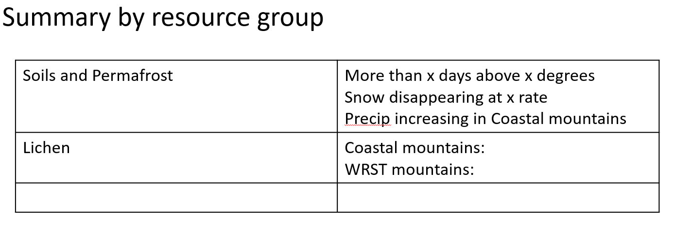

```{r setup, include=FALSE}
knitr::opts_chunk$set(echo = TRUE)
```

```{r Initials, echo=FALSE, message=FALSE, warning=FALSE}

rm(list = ls())

library(stars);library(dplyr);library(ggplot2);library(ggthemes);library(viridis);library(here);library(ggrepel);library(rlang);library(units);library(knitr)

working.dir <- "C:/Users/achildress/Documents/wrst_temp"
data.dir = paste0(working.dir,"/Data")
plot.dir = paste0(working.dir, "/Plots")

# data.dir <- paste(working.dir, "Data", area, sep="/")
# plot.dir 

historical.period <- as.character(seq(1950,1999,1))
future.period <- as.character(seq(2025,2055,1))
daymet.period <- as.character(seq(1980,2016,1))

GCMs <- c("inmcm4.rcp85","ACCESS1-3.rcp45","CanESM2.rcp85")
CFs <- c("Climate Future 1", "Climate Future 2", "Climate Future 3")
cols <- c("#12045C","#ffcccc","#E10720")

CF_GCM <- data.frame(CF=CFs,GCM=GCMs,CF_col=cols)

group = "vegetation"

```

## Introduction

<!-- Will be the same for all resources -->

Plausible climate futures for Wrangell-St. Elias National Park & Preserve (WRST) are expressed in terms of future (2025-2055) change relative to late-20<sup>th</sup>-century conditions (1950-1999). The climate information summarized here is from projected, gridded data, downscaled at 15km (BCSD; @Mizukami2021). Due to the size and complex geography of the park, climate futures are presented spatially, with timeseries of the spatial means across each area shown to characterize the dynamics.  The four geographic areas are distinct climate and ecological zones in WRST (Figure 1).

{width="431"}


Climate futures are from projections from ten global climate model (GCMs), run under two contrastic greenhouse gas emissions scenarios (RCP4.5 and RCP8.5). The GCMs were selected for their model performance in Alaska @Mizukami2021. They represent a range of plausible future climates for the park over the coming decades.From these 20 projections (10 GCMs x 2 emissions scenarios), three divergent climate futures were chosen that characterized the range of uncertainty across all trajectories. The uncertainty was measured across the climate metrics that park and subject-matter experts expressed as the most consequential for resources at WRST (Figure 2). Those *consequential* climate metrics are listed in Table 1, below. See (@Runyon2021)[https://irma.nps.gov/DataStore/Reference/Profile/2286672] and (@Lawrence2021)[https://link.springer.com/epdf/10.1007/s10584-021-03169-y?sharing_token=MufjWsIQwncLzXdQ2awm9Pe4RwlQNchNByi7wbcMAY48-OL9-_d-75TukkQDtC_QgmuzZqcD52_phTlMsDeKUZ3hlN2p-e60d1ZHtYKyTYClg80yAvWfomsQIPT76_NhyeJSwspZWfdbrpOv4l1egfAD8shVTBGLvZL2_N5-GaQ%3D] for details on model selection methodology.


```{r CF color table,eval=TRUE,echo=FALSE}
writeLines("td, th { padding : 6px } th { background-color : brown ; color : white; border : 1px solid white; } td { color : brown ; border : 1px solid brown }", con = "mystyle.css")
knitr::kable(CF_GCM[,1:2], format="markdown", caption=paste0("**Table 1.**","GCMs selected as climate futures. Climate future colors are consistent throughout this document."))

# colorSub=nameVector(rainbow(10), c(letters[1:5], LETTERS[1:5])),
# row_color_by="B")
```


```{r T1 metrics, eval=TRUE, echo=FALSE}
t1.metrics = data.frame(Metric=c("Seasonal (DJF, MAM, JJA, SON) average temperature",
                                 "Seasonal (DJF, MAM, JJA, SON) average precipitation",
                                 "Maximum annual snow depth",
                                 "Shoulder season (MAM & SON) snow",
                                 "Water balance"))

kable(t1.metrics, caption = paste0("**Table 2.**","Climate metrics representing most challenging climate sensitivities for resources at WRST."))
```


## `r group`

Park and subject matter experts identified the following metrics as sensitivities for vegetation in WRST (Table 2). These metrics are evaluated for each of the three climate futures in the subsequent sections of this packet. Use this table when determining implications ((resource implications homework)[])  of each of the climate futures on each resource to identify metrics to review.

```{r resource-sensitivities-table, echo=FALSE, results='asis'}
metrics=read.csv(paste0("Data/files-for-knitting/", group, "-metrics.csv"))
kable(metrics, caption = paste0("Climate sensitivities for ", group, " resources"))
#needs to be reformatted
```


### Climate futures summary

The following table summarizes key climate features for each `r group` resource that are illustrated in figures and tables in this document. 

[**Table 3.** Commonalities and differences among the climate futures.]

<!-- Insert CF summary table -->

### Resource-specific summaries

**Table 4.** Vegetation resources summary



## Climate futures

### Fundamental climate metrics
The following figures illustrate seasonal change (1950-1999 vs 2025-2055) in basic climate metrics. Seasons are characterized as yearly quarters: DJF = December, January, February; MAM = March, April, May; JJA = June, July, August; SON = September, October, November. 

Unless specified, average values displayed as change values in dotplots or annual averages in timeseries plots are averaged across all grid cells in the geographies represented in each map. 


```{r monthly summary, eval=TRUE, echo=FALSE}
monthly.summary = read.csv("Data/files-for-knitting/Monthly_summary.csv")

kable(monthly.summary, caption = paste0("**Table 5.**","WRST climate futures (average for 3-decade period 2025–2055), expressed in terms of change relative to the historical period (1950–1999), with negative values indicating declines. The “Historical” column represents the 1950-1999 average value for each metric."))
```


The following figure panels illustrate change in the specified metric between the historical period (1950-1999) and each climate future (2025-2055).Timeseries plots compare recent climate trends using observed, gridded climate data (Daymet) from 1980-2016 to climate futures. The bottom-right tables summarize the mean annual values for the historical period (Daymet) and each climate future. The historical period is represented as an absolute value and climate futures are change values, so negative values indicate a decline in the metrics (e.g., Average temperature = 20 (\u00B0F), the climate futures are increasing 2-6 (\u00B0F))    


### Threshold metrics

The following plots represent annual averages for threshold exceedance metrics in different regions of WRST (see Figure 1). The values represent the average of all 15-km grid cells within each region. Timeseries plots compare recent climate trends using observed, gridded climate data (Daymet) from 1980-2016 to climate futures. The bottom-right tables summarize the mean annual values for the historical period (Daymet) and each climate future. The historical period is represented as an absolute value and climate futures are change values, so negative values indicate a decline in the metrics.

Freeze-thaw is the number of freeze-thaw cycles per year, calculated as days when the maximum temperature >34 (\u00B0F) and the minimum temperature <28 (\u00B0F).

Tmin < 32 (\u00B0F) is the number of days per year when the minimum temperature is below 32 (\u00B0F).

Tmax > 68 (\u00B0F) is the number of days per year when the maximum temperature is above 68 (\u00B0F).

Tmin > 32 (\u00B0F) in DJF is the number of days per year during December-February when the minimum temperature is above 32 (\u00B0F).

Precip > 0.5 inches is the number of days per year when precipitation is greater than 0.5 inches.


### Snow metrics
The following figure panels illustrate change in the specified metric between the historical period (1950-1999) and each climate future (2025-2055).Timeseries plots compare recent climate trends using observed, gridded climate data (Daymet) from 1980-2016 to climate futures. The bottom-right tables summarize the mean annual values for the historical period (Daymet) and each climate future. The historical period is represented as an absolute value and climate futures are change values, so negative values indicate a decline in the metrics.

The snow metrics were calculated using a variable infiltration capacity (VIC) model on the same 15-km grid, provided by NCAR @Mizukami2021. 


he following plots show yearly daily runoff and snow water equivalent (SWE) values for each year. The historical period is observed, gridded climate data (Daymet) from 1980-2016; climate future are from 2025-2055. Figures are produed for the different regions of WRST (see Figure 1) and values are averages of all 15-km grid cells within each region. These metrics were calculated using a variable infiltration capacity (VIC) model on the same 15-km grid, provided by NCAR @Mizukami2021. 


### Soils and permafrost metrics
The following figure panels illustrate change in the specified metric between the historical period (1950-1999) and each climate future (2025-2055).Timeseries plots compare recent climate trends using observed, gridded climate data (Daymet) from 1980-2016 to climate futures. The bottom-right tables summarize the mean annual values for the historical period (Daymet) and each climate future. The historical period is represented as an absolute value and climate futures are change values, so negative values indicate a decline in the metrics.

The soil metrics were calculated using a variable infiltration capacity (VIC) model on the same 15-km grid, provided by NCAR @Mizukami2021. 


<!-- Figure out how to center -->

Email [Amber Runyon](amber_runyon@nps.gov) with questions about material in this document\
\

Code available at [WRST GitHub repository](https://github.com/nationalparkservice/WRST-climate-futures)\
\

Climate information developed in collaboration with [Jeremy Littell](jlittell@usgs.gov), U.S.G.S. Alaska Climate Adaptation Science Center\
\

Downscaled climate projections provided by Andrew Newman, National Center for Atmospheric Research @Mizukami2021\
\

