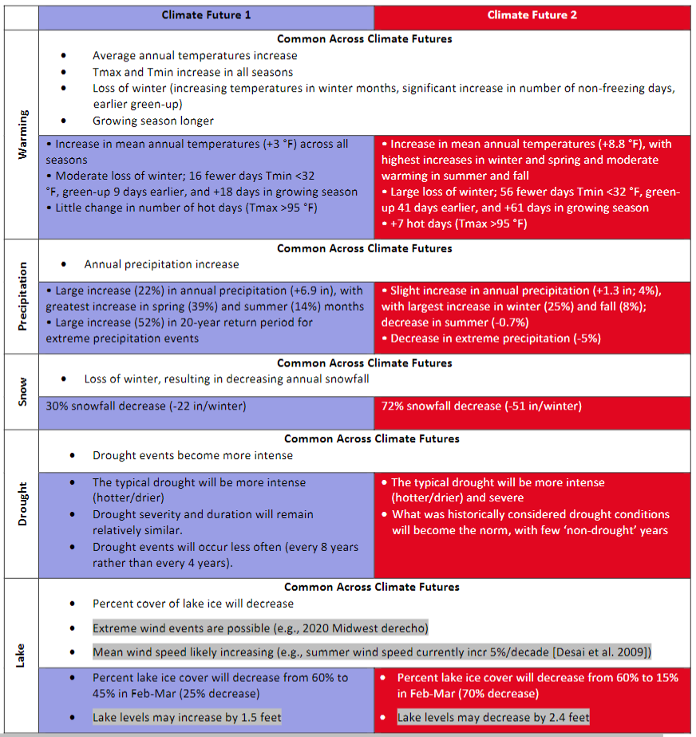

```{r setup, include=FALSE}
knitr::opts_chunk$set(echo = TRUE)
```

```{r Initials, echo=FALSE, message=FALSE, warning=FALSE}

rm(list = ls())

library(stars);library(dplyr);library(ggplot2);library(ggthemes);library(viridis);library(here);library(ggrepel);library(rlang);library(units)

working.dir <- "C:/Users/achildress/Documents/wrst_temp"
data.dir = paste0(working.dir,"/Data")
plot.dir = paste0(working.dir, "/Plots")

# data.dir <- paste(working.dir, "Data", area, sep="/")
# plot.dir 

historical.period <- as.character(seq(1950,1999,1))
future.period <- as.character(seq(2025,2055,1))
daymet.period <- as.character(seq(1980,2016,1))

GCMs <- c("inmcm4.rcp85","ACCESS1-3.rcp45","CanESM2.rcp85")
CFs <- c("Climate Future 1", "Climate Future 2", "Climate Future 3")
cols <- c("#12045C","#ffcccc","#E10720")

CF_GCM <- data.frame(CF=CFs,GCM=GCMs,CF_col=cols)


```

## Introduction

<!-- Will be the same for all resources -->

Plausible climate futures for Wrangell-St. Elias National Park & Preserve (WRST) are expressed in terms of future (2025-2055) change relative to late 20-th-century conditions (1950-1999). The climate information summarized here is from projected, gridded data, downscaled at 15km (BCSD; *citation from A. Newman to come*). Due to the size and complex geography of the park, climate future data are presented spatially, with timeseries aggregations performed across four geographic areas representing distinct climate and ecological zones in WRST (Figure 1).

{width="431"}


Climate futures are from ten GCM projections, run under two emissions scenarios (RCP4.5 and RCP8.5), selected for their model performance in Alaska. They represent a range fo plausible ways that climate change could play out in the park over the coming decades.Three divergent climate futures were chosen by selecting the projections that characterized the broadest extent of uncertainty for metrics that park and subject-matter experts expressed as the most consequential for resources at WRST (Figure 2). The consequential climate metrics are listed in Table 1, below. See [insert reference for WICA report] for details on model selection methodology.


```{r CF color table,eval=TRUE,echo=FALSE}
writeLines("td, th { padding : 6px } th { background-color : brown ; color : white; border : 1px solid white; } td { color : brown ; border : 1px solid brown }", con = "mystyle.css")
knitr::kable(CF_GCM[,1:2], format="markdown")

# colorSub=nameVector(rainbow(10), c(letters[1:5], LETTERS[1:5])),
# row_color_by="B")
```


| Metric                                              |
|-----------------------------------------------------|
| Seasonal (DJF, MAM, JJA, SON) average temperature   |
| Seasonal (DJF, MAM, JJA, SON) average precipitation |
| Maximum annual snwo depth                           |
| Shoulder season (MAM & SON) snow                    |
| Water balance                                       |

: Table 1. Climate metrics representing most challenging climate sensitivities for resources at WRST


## Vegetation

Park and subject matter experts identified the following metrics as sensitivities for vegetation in WRST (Table 2). These metrics are evaluated for the three climate futures in the subsequent sections of this packet. Use this table when determining implications of each of the climate futures on each resource component to identify metrics to review.


### Climate futures summary

[Hope to do for veg: Insert quick summary of each of the climate futures. For now likely to be something I do by hand and enter as a formatted table, like one pasted below]



### Resource-specific summaries

[Hope to do for veg: Insert quick summary high-points of each CF by resource. For now will be formatted table, entered manually. Example below]


## Climate futures

### Fundamental climate metrics
The following figures illustrate seasonal change (1950-1999 vs 2025-2055) in basic climate metrics. Seasons are characterized as yearly quarters: DJF = December, January, February; MAM = March, April, May; JJA = June, July, August; SON = Septemper, October, November. 

Unless specified, average values displayed as change values in dotplots or annual averages in timeseries plots are averaged across all grid cells in the geographies represented in each map. 


### Soils and permafrost metrics

### Threshold metrics

[This will be four panels, one for each area in the park]

### Snow metrics

### Soils and permafrost metrics

<!-- Figure out how to center -->

Email [Amber Runyon](amber_runyon@nps.gov) with questions about material in this document\
Code available at [WRST GitHub repository](https://github.com/nationalparkservice/WRST-climate-futures)\
Climate information developed in collaboration with [Jeremy Littell](jlittell@usgs.gov), U.S.G.S. Alaska Climate Adaptation Science Center Downscaled climate projections provided by Andrew Newman, National Center for Atmospheric Research.
